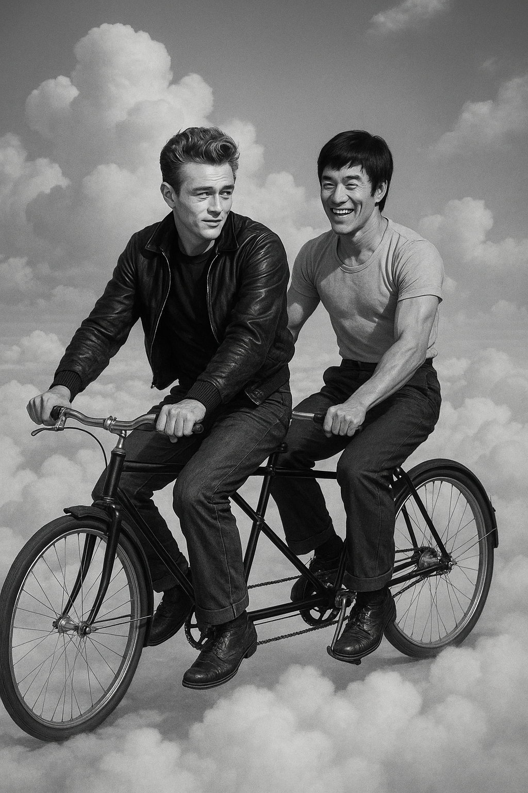
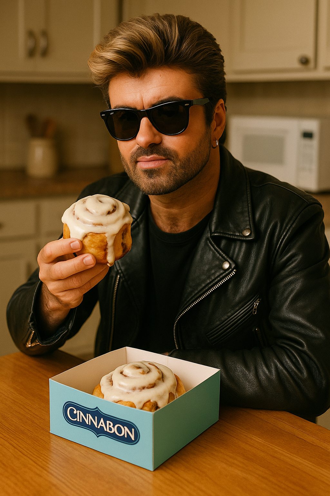
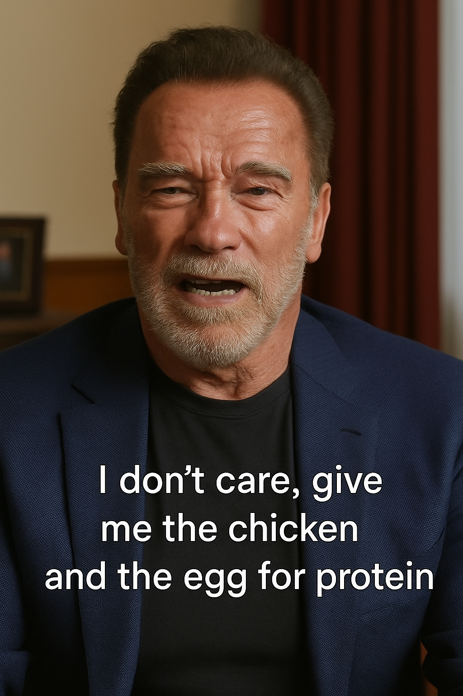

<html lang="en">
<head>
  <meta charset="UTF-8">
  <meta name="viewport" content="width=device-width, initial-scale=1.0">
  <title>SoRealosity</title>
  <link href="https://fonts.googleapis.com/css2?family=Press+Start+2P&display=swap" rel="stylesheet">
  
</head>
<body>
  <header>
    
SoRealosity

    
<i>Surreal iconic images that never happened, but should have!</i>

  </header>

  <section class="products">
    

      
      

        <h3>Sinatra on a Toilet</h3>
        
Marilyn Monroe hands him the roll. Glam meets absurdity.

        <button>Buy Print</button>
      

    

    

      
      

        <h3>Churchill Breakdancing</h3>
        
The PM with power moves. History’s hottest remix.

        <button>Buy Print</button>
      

    

    

      
      

        <h3>Hitchcock's Dinner Scene</h3>
        
Alfred Hitchcock directs a surreal dinner with Julia Child and Hannibal Lecter — culinary tension with a twist of horror.

        <button>Buy Print</button>
      

    

    <!-- Art 4 -->

  
  
Bruce Lee and Dean Martin in Heaven

  <button onclick="buyArt('art4.jpg')">Buy Print</button>

<!-- Art 5 -->

  
  
Barbara Walters interviewing Satan

  <button onclick="buyArt('art5.jpg')">Buy Print</button>

<!-- Art 6 -->

  
  
George Michael eating a Cinnabon instead of singing jitterbug

  <button onclick="buyArt('art6.jpg')">Buy Print</button>

<!-- Art 7 -->

  
  
Arnold telling you just eat protein, who cares about what comes first between chicken and egg

  <button onclick="buyArt('art7.jpg')">Buy Print</button>

<!-- Art 8 -->

  
  
Coach Ted Lasso directing a classic chess match between greats Ronaldo and Messi with legends watching

  <button onclick="buyArt('art8.jpg')">Buy Print</button>

<!-- Art 9 -->

  
  
David Bowie and Mr. Rogers

  <button onclick="buyArt('art9.jpg')">Buy Print</button>

  </section>

  
&copy; 2025 SoRealosity.com delivers AI-powered artwork where Pop Culture, History, and Absurdity Collide in Iconic Style!  Retro Icons, Twisted Realities, Timeless Cool 

</body>
</html>

 

