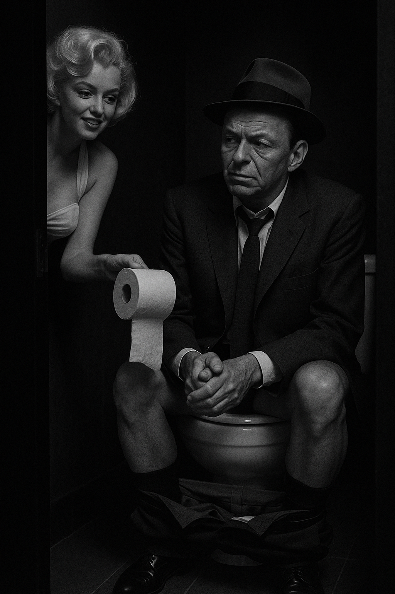
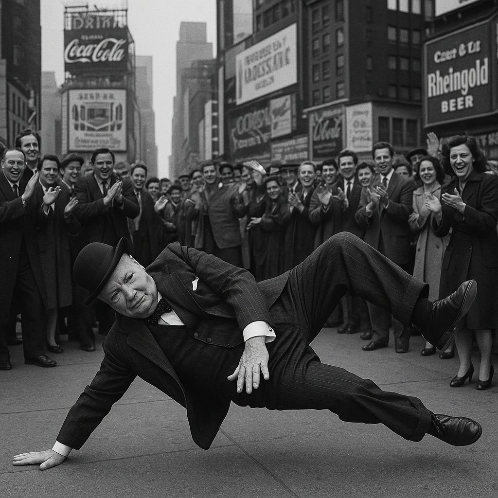
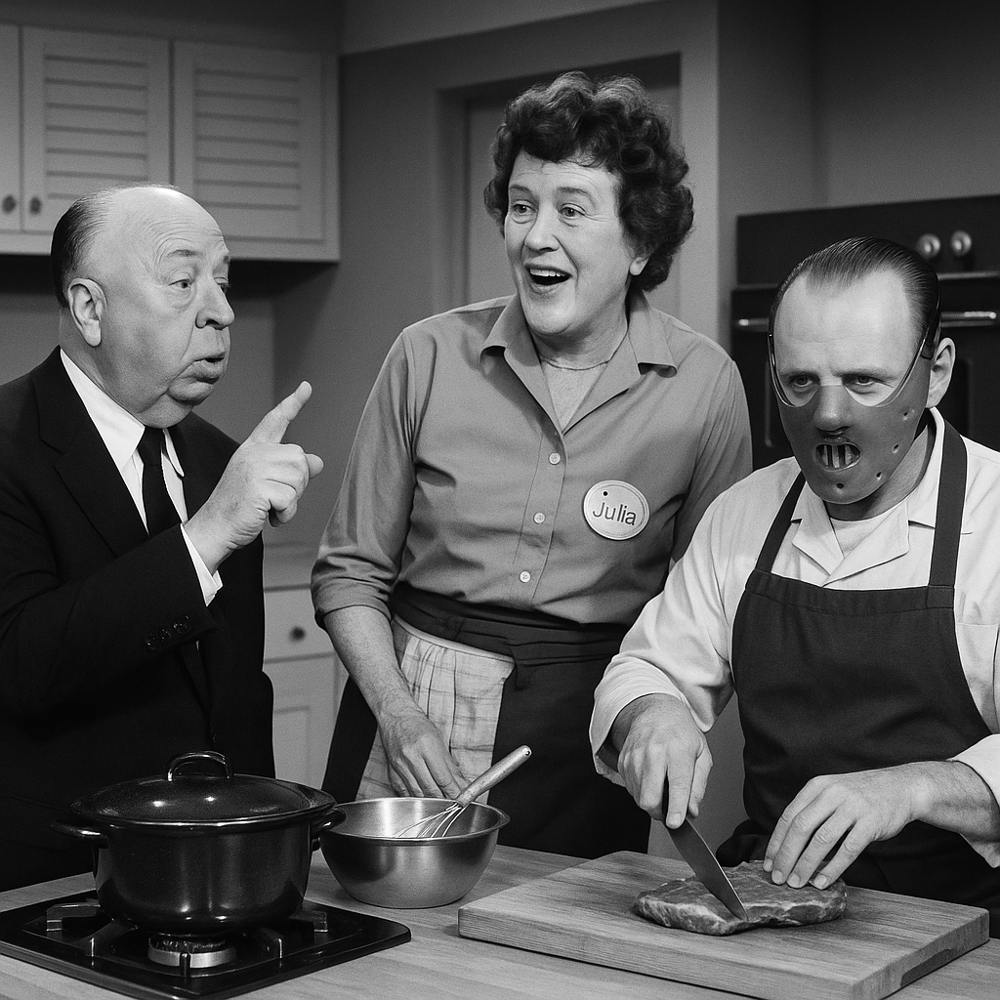

<!DOCTYPE html>
<html lang="en">
<head>
  <meta charset="UTF-8" />
  <meta name="viewport" content="width=device-width, initial-scale=1.0" />
  <title>SoRealosity</title>
  <link href="https://fonts.googleapis.com/css2?family=Orbitron:wght@600&family=Press+Start+2P&display=swap" rel="stylesheet">
  
</head>
<body>
  <header>SoRealosity</header>
  
Where Retro Gets Real — Digital Dreams, Printed Magic

  <section class="section">
    <h2>Explore Our One-of-a-Kind Retro Art</h2>
    
SoRealosity delivers AI-powered nostalgic artwork inspired by iconic moments that never happened — but should have.

  </section>

  <section class="products">
    

      
      

        <h3>Sinatra on a Toilet</h3>
        
Marilyn Monroe hands him the roll. Glam meets absurdity.

        <button>Buy Print</button>
      

    

    

      
      

        <h3>Churchill Breakdancing</h3>
        
The PM with power moves. History’s hottest remix.

        <button>Buy Print</button>
      

    

    

      
      

        <h3>Hitchcock's Dinner Scene</h3>
        
Alfred Hitchcock directs a surreal dinner with Julia Child and Hannibal Lecter — culinary tension with a twist of horror.

        <button>Buy Print</button>
      

    

  </section>

  
&copy; 2025 SoRealosity.com — Designed in the Twilight Zone

</body>
</html>
