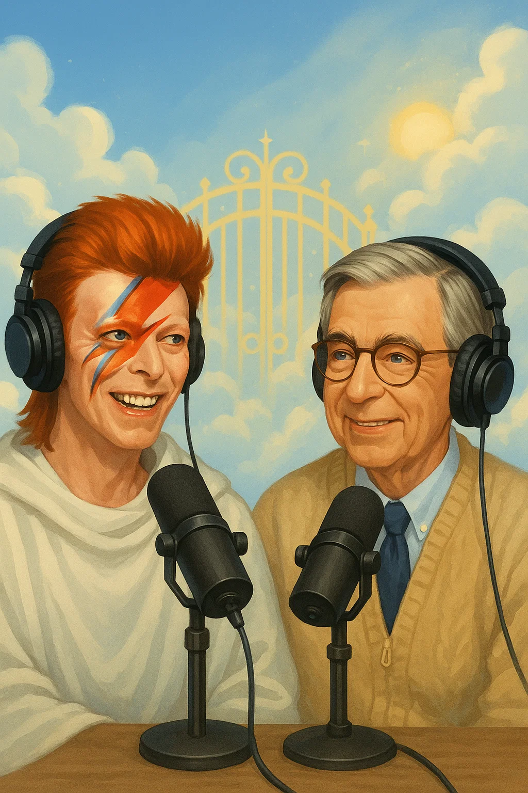

<html lang="en">
<head>
  <meta charset="UTF-8">
  <meta name="viewport" content="width=device-width, initial-scale=1.0">
  <title>SoRealosity</title>
  <link href="https://fonts.googleapis.com/css2?family=Press+Start+2P&display=swap" rel="stylesheet">
  
</head>
<body>
  <header>
    <h1>SoRealosity</h1>
    
SoRealosity delivers AI-powered nostalgic artwork inspired by iconic moments that never happened — but should have.

  </header>
  

  

    
    
Alfred Hitchcock directs an unsettling dinner between Julia Child and Hannibal Lecter in a surreal culinary thriller.

  

  

    
    
Frank Sinatra, mid-song on a golden toilet, gets an assist from Marilyn Monroe with a roll of retro pink toilet paper.

  

  

    
    
Winston Churchill, in a pinstripe suit and bowler hat, breakdancing beneath neon lights at Studio 54.

  

</body>
</html>

